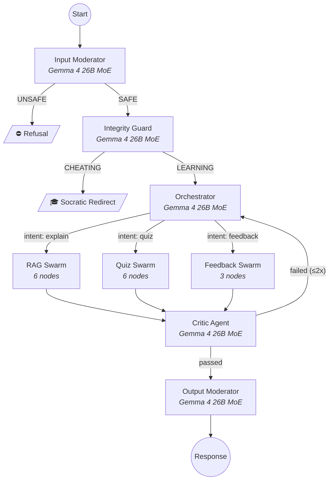
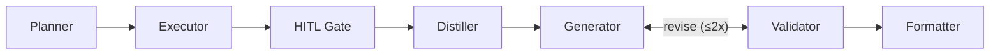
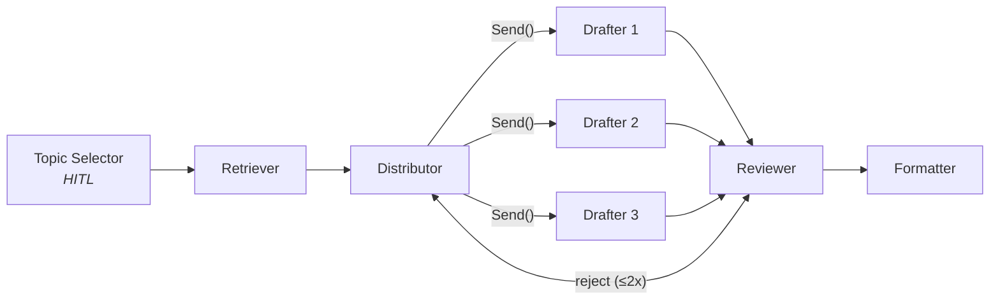
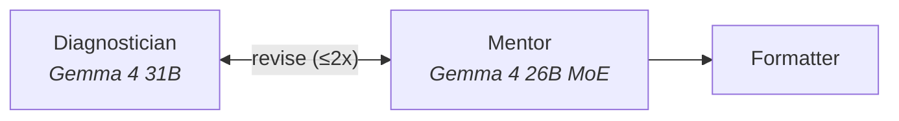

# Architecture

This document walks through how the system actually works, node by node. If you're a judge, this is the proof-of-work. If you're a developer, this is the map.

For the high-level overview, see the [README](./README.md).

---

## The Graph

EduVerse is a single LangGraph `StateGraph` compiled at server startup. Every student message enters at the top and exits at the bottom. There are no shortcuts.



### Why This Shape

The triple-entry security (`Input Mod → Integrity Guard → Orchestrator`) exists because a single moderator can't catch everything. Input Mod handles raw safety (PII, NSFW, injection). Integrity Guard handles *pedagogical* safety — detecting when a student is asking the AI to just do their homework. These are different classification tasks and need separate prompts.

The Critic → Orchestrator loop enables **end-to-end self-correction**. If the final output is bad, we don't just patch it — the entire pipeline re-runs with the critic's feedback injected into the state. This is more expensive but produces genuinely better output than trying to fix a bad draft.

---

## RAG Swarm

File: `backend/app/agents/rag_subgraph.py` (480 lines)

This is the core tutoring pipeline. Six nodes, each with a specific job:



**Planner** rewrites the student's raw question into an optimized search query. Uses structured output (`PlannerOutput` schema) to extract the rewritten query. This matters because students ask messy questions — "idk how the thing in ch3 works" needs to become "mechanism of action chapter 3 enzyme kinetics" before retrieval.

**Executor** runs hybrid retrieval:
1. MongoDB Atlas Vector Search (Nomic embeddings, 768d) for semantic similarity
2. MongoDB Atlas Search (Lucene BM25) for keyword matching
3. Reciprocal Rank Fusion merges both result sets
4. Cohere Rerank v3.5 re-scores the top candidates

The executor then labels the retrieval confidence:
- `CLASSROOM_GROUNDED` — strong match (score ≥ grounding threshold)
- `CLASSROOM_LOW_CONFIDENCE` — decent match, proceed with caveats
- `CLASSROOM_INSUFFICIENT` — not enough relevant material found

**HITL Gate** fires only on `CLASSROOM_INSUFFICIENT`. It calls LangGraph's `interrupt()`, which checkpoints the entire graph state to MongoDB and pauses execution. The frontend shows the student a choice: "Should I search the web, or work with what's in your course materials?" The graph resumes when the student responds via `POST /chat/stream/resume`.

This is a deliberate design choice. We don't silently fall back to web search — the student stays in control of what sources they trust.

**Distiller** sorts retrieved documents by relevance score and enforces a token budget. No LLM call here — just ranking and truncation.

**Generator** produces the actual pedagogical response using Gemma 4 31B Dense. The prompt injects a reasoning trigger: `Begin your response with <think> to plan the Socratic scaffolding`. The `<think>` trace is extracted post-generation and stored in `agent_thoughts` for the X-Ray panel. The generator calls `TransferToValidator` when done, passing its draft.

For multimodal inputs (uploaded images), the generator receives both text and base64-encoded image data in a single prompt.

**Validator** adversarially fact-checks the draft against the source documents. It has access to two tools:
- `web_search_tool` (SerperDev) — for verifying claims against external sources
- `python_repl_tool` (E2B sandbox) — for checking math and code

If the validator finds grounding issues, it calls `TransferToGenerator` and the draft goes back for revision (max 2 rounds). If clean, it calls `TransferToFormatter`.

**This is where DPO pairs are captured.** On every revision, `SwarmLoop.extract_dpo_pairs()` saves the rejected draft as the "losing" response and the revised draft as the "winning" response. The validator's critique is attached as metadata.

**Formatter** extracts `[Doc N]` citation references from the final draft, maps them to source documents, and builds structured `Citation` objects with page-precise deep-links back to the original PDFs.

---

## Quiz Swarm

File: `backend/app/agents/quiz_subgraph.py` (252 lines)

Map-Reduce architecture for parallel MCQ generation.



**Topic Selector** is another HITL node. It pauses the graph and asks the student what to quiz them on: course material, previous year questions, or weak topics from their profile.

**Distributor** uses LangGraph's `Send()` API for true parallel fanout. Three independent drafter workers execute concurrently, each producing one MCQ with a structured `QuizQuestion` schema:

```python
class QuizQuestion(BaseModel):
    question: str
    options: list[str]       # 4 options
    correct_answer: str
    bloom_level: Literal["Remember", "Understand", "Apply", "Analyze", "Evaluate", "Create"]
    distractor_reasoning: str  # Why each wrong answer is pedagogically useful
```

Each drafter uses Gemma 4 26B MoE — the MoE architecture is critical here because we're running 3 concurrent inference calls. With only 4B active parameters per forward pass, the latency stays manageable.

**Reviewer** consolidates all three MCQs and quality-gates them. Has access to web_search and python_repl tools. If the questions are too easy, factually wrong, or don't cover the right Bloom's levels, it calls `TransferToDrafter` and the entire batch is regenerated. DPO pairs are captured on every rejection.

---

## Feedback Swarm

File: `backend/app/agents/feedback_subgraph.py` (252 lines)

Root-cause analysis with growth-mindset scoring.



**Diagnostician** takes the student's quiz responses and performs per-question RCA. It uses an agentic tool-calling loop — it can execute Python code to verify mathematical work and search the web to fact-check contemporary claims. For each incorrect answer, it classifies the root cause: `Calculation Error`, `Conceptual Gap`, `Reading Misinterpretation`, or `Correct`.

Uses Gemma 4 31B Dense because root-cause analysis requires deeper reasoning than classification.

**Mentor** quality-gates the feedback through a growth-mindset lens. If the diagnostician's feedback is overly negative ("You got this wrong because you don't understand anything") or lacks actionable advice, it sends it back for revision. DPO pairs are captured on every rejection.

---

## The Critic

File: `backend/app/agents/critic.py` (106 lines)

Sits at the graph's exit, between every swarm and the output moderator. Uses `CriticOutput` structured schema:

```python
class CriticOutput(BaseModel):
    severity: Literal["none", "low", "high"]
    issues: list[str]              # specific grounding problems
    passed: bool                   # the gate
    required_facts: list[str]      # facts that should have been cited
    pedagogical_fidelity: Literal["poor", "average", "excellent"]
    is_socratic: bool              # did the agent lead, not tell?
    validated_citations: int       # count of verified citations
```

If `passed = false` and we haven't exceeded 2 retries, the critic routes back to the orchestrator. The critic's `issues` list is injected into the state, so the next generation cycle can see what went wrong.

---

## Model Routing

File: `backend/app/utils/llm_pool.py`

The `LLMFactory` maps agent roles to Gemma 4 variants at runtime:

| Role | Model | Active Params | Why |
|------|-------|:---:|-----|
| Orchestrator | 26B-A4B (MoE) | 4B | Fast intent classification |
| Guardrails (3x) | 26B-A4B (MoE) | 4B | Safety checks must be fast |
| Quiz Drafters (3x) | 26B-A4B (MoE) | 4B | Parallel execution, latency-sensitive |
| Validators / Critics | 26B-A4B (MoE) | 4B | Structured schema output |
| RAG Generator | 31B (Dense) | 31B | Deep pedagogical reasoning |
| Feedback Diagnostician | 31B (Dense) | 31B | Root-cause analysis needs depth |
| Vision (multimodal) | 26B-A4B (MoE) | 4B | Image understanding |
| DPO Teacher | Gemini 2.5 Pro | — | Background distillation only |

Every chain has `.with_fallbacks([gemini_flash])` — if the Gemma 4 endpoint returns a 500, the system degrades to Gemini Flash rather than crashing the student's session.

---

## Retrieval Pipeline

File: `backend/app/retrieval/retriever.py`

```
Student query
  ↓
Semantic cache lookup (MongoDB vector similarity)
  ├── HIT → return cached context (skip everything below)
  └── MISS:
        ├── MongoDB Atlas Vector Search (Nomic embeddings, 768d)
        ├── MongoDB Atlas Search (Lucene BM25)
        └── Reciprocal Rank Fusion
              ↓
        Cohere Rerank v3.5 (top-N re-scoring)
              ↓
        Parent chunk resolution (child → parent mapping)
              ↓
        Confidence labeling + explainability payload
              ↓
        Background cache save
```

**Parent-child chunking:** Documents are split into 4K-token parent chunks and 1K-token child chunks (200 token overlap). Retrieval searches children for precision, then fetches parents for context. This lets the generator see both the targeted relevant passage and its surrounding context.

**Explainability:** The `build_explainability()` function in `retrieval/explainability.py` produces a per-source breakdown for the X-Ray panel: confidence scores, "why this source was chosen" annotations, and relevance percentages.

---

## DPO Data Collection

DPO pairs are captured at three points — one per swarm:

| Swarm | Agent Name | Trigger |
|-------|-----------|---------|
| RAG | `rag_tutor_generator` | Validator rejects generator draft |
| Quiz | `quiz_drafter` | Reviewer rejects MCQ batch |
| Feedback | `feedback_mentor` | Mentor rejects diagnostician analysis |

`SwarmLoop.extract_dpo_pairs()` (in `agents/swarm_engine.py`) standardizes the format:

```json
{
  "agent": "rag_tutor_generator",
  "prompt": "Explain the Krebs cycle using my Bio 201 notes",
  "chosen": "Let's break this down step by step...",
  "rejected": "The Krebs cycle produces ATP through...",
  "critique": "Draft contained unsupported claim about ATP yield"
}
```

After each interaction, `AnalyticsService.process_post_run()` persists:
- DPO pairs → `dpo_pairs` collection
- RL trajectories with reward scores → `rl_trajectories` collection  
- Raw reasoning traces → `raw_trajectories` collection
- User profile updates (weak topics, mastery deltas)

---

## Training Pipeline

File: `backend/app/services/training/training_orchestrator.py`

Five-step pipeline, runs as a background task:

1. **Shadow Auditor catchup** — Polls unaudited trajectories from MongoDB, sends each to Gemini 2.5 Pro with a role-specific teacher prompt. The teacher produces a gold-standard response and critique. This adds higher-quality "chosen" examples to the DPO dataset.

2. **Export** — Pulls all DPO pairs from MongoDB. Filters for agents with ≥150 pairs. Agents below threshold are skipped.

3. **Kaggle push** — Generates `kernel-metadata.json`, serializes the DPO dataset to JSONL, pushes to Kaggle as a private kernel with GPU enabled.

4. **Poll** — Waits for Kaggle kernel completion (60s polling interval).

5. **Evaluate & promote** — Downloads fine-tuned weights. Runs pairwise evaluation via `EvalService` (Gemini 2.5 Pro as judge, scoring on Grounding, Clarity, Tone, and Hallucination on 1-10 scales). If improvement exceeds 15% → registers in model registry → uploads GGUF to HuggingFace.

Target: fine-tuning **Gemma 4 E4B** via DPO + LoRA per agent role (`tutor`, `quiz`, `feedback`).

---

## Data Model

| Collection | What's In It |
|-----------|-------------|
| `child_chunks` | 1K-token chunks with vector embeddings (Atlas Vector Search index) |
| `parent_chunks` | 4K-token chunks with full metadata |
| `semantic_cache` | Query → response cache with vector similarity lookup |
| `dpo_pairs` | (prompt, chosen, rejected) per agent |
| `rl_trajectories` | Per-interaction reward scores and critic reviews |
| `model_registry` | Version tracking for fine-tuned models |
| `chat_sessions` | Conversation history per user/course/session |
| `user_profiles` | Weak topics, mastery scores, session counts |
| `oauth_tokens` | Encrypted Google OAuth credentials (Fernet) |
| `ingestion_jobs` | Pipeline status tracking with heartbeats |

---

## Security

- **Auth:** Google OAuth → JWT (HS256). Frontend uses NextAuth, backend validates JWTs via middleware.
- **Scoping:** All queries filter by `user_id`. Students only see their own data.
- **Encryption:** OAuth tokens encrypted at rest with Fernet.
- **Privacy:** No student data exits the system except through the Shadow Auditor path, which processes anonymized query/response pairs for model improvement.
