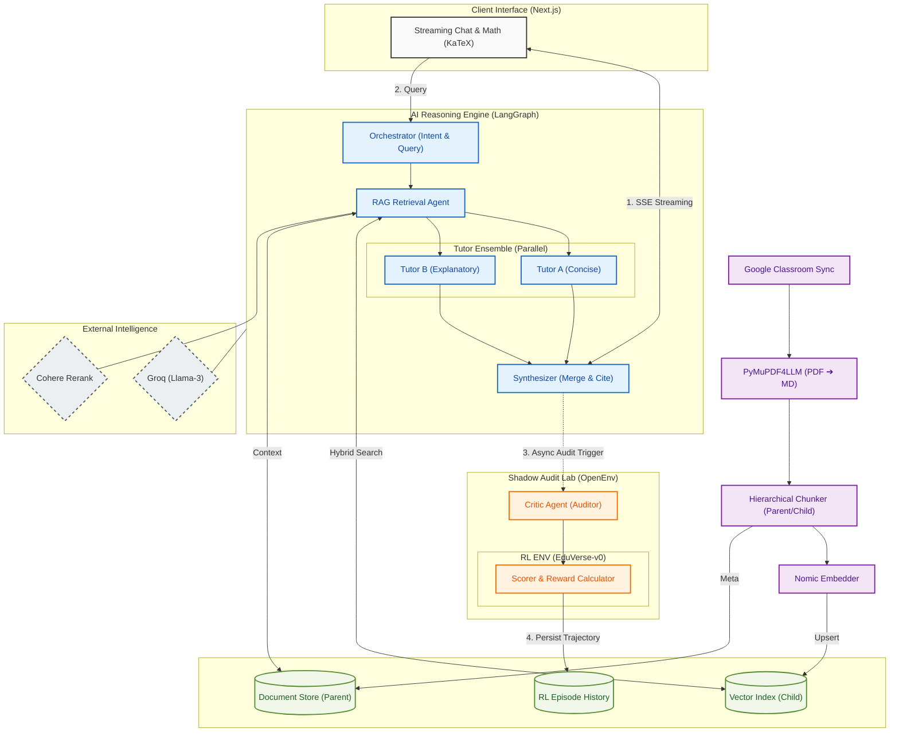

# EduVerse

EduVerse is a comprehensive, enterprise-grade AI tutoring platform designed to integrate deeply with students' existing educational ecosystems (Google Classroom, Drive, Gmail). It leverages an advanced multi-agent reinforcement learning (RL) guided pipeline to provide highly accurate, grounded, and personalized educational discourse.

##  Key Features
- **Multi-Agent RAG Orchestration**: A `LangGraph` stategraph coordinating Orchestrator, RAG, distinct Tutor personas (Concise vs. Explanatory), a Synthesizer, and a rigorous Critic.
- **Enterprise-Grade Grounding**: Uses Nomic embeddings, MongoDB Atlas Hybrid Search (Vector + BM25), and Cohere reranking.
- **Continuous Reinforcement Learning**: Includes a custom OpenEnv-compatible Gymnasium environment (`EduverseEnv`) for pipeline evaluation and shadow auditing.
- **Ecosystem Integration**: Directly pairs with NextAuth for seamless syncing with Google Classroom courseworks, documents, and student events.
- **Dynamic Context Caching**: Reduces Token Time to First Byte (TTFT) by utilizing MongoDB-based semantic caching.

---

##  Architecture & Model Flow

EduVerse operates on a complex but highly modular `LangGraph` pipeline. 

### Core AI Flow Diagram



### Flow Breakdown:
1. **Orchestrator**: Quickly assesses the student's query, determining the task type (qa, explain, quiz, feedback, timetable). It rewrites queries iteratively for optimal semantic search.
2. **Retrieval (RAG)**: If the query is related to coursework, the system checks the `Semantic Cache`. If missing, it uses a Hybrid Search (Nomic Embeddings + BM25) and passes candidates to a Cohere Reranker. Fetches sliding-window parent chunks to provide broad context. Huge contexts are map-reduce distilled.
3. **Parallel Personas**: `Tutor A` (precise, formula-based) and `Tutor B` (empathetic, analogy-rich) generate parallel responses grounded in the retrieved context.
4. **Synthesizer & Critic**: The `Synthesizer` combines these drafts to give the student the "best of both worlds". The `Critic` immediately reviews the final response strictly against the context chunks. If it catches a severe hallucination, it forces a targeted rewrite before the user ever sees it.

---

## 📁 Directory Structure

```text
EduVerse/
├── backend/                        # Python FastAPI Backend
│   ├── app/
│   │   ├── agents/                 # LangGraph Agent Nodes (orchestrator, tutor, critic, etc.)
│   │   ├── api/routes/             # FastAPI Endpoints (SSE /chat/stream, /ingest, /auth)
│   │   ├── db/                     # MongoDB Operations (Profiles, OAuth, History, Caching)
│   │   ├── ingestion/              # Ingestion Pipelines (Chunking, PyMuPDF, Embedding)
│   │   ├── retrieval/              # Vector Hybrid Search & Context Compression
│   │   ├── rl/                     # Reinforcement Learning Gym Env & Reward Functions
│   │   ├── services/               # Integrations (Gmail, Groq Vision, Classroom)
│   │   ├── utils/                  # Helper tools (LLM Round-Robin Pools, Token utils)
│   │   ├── config.py               # Pydantic Settings & Environment Parsing
│   │   └── main.py                 # FastAPI Application Entrypoint
│   ├── scripts/                    # Helper scripts for JWT generation, E2E testing
│   ├── .env                        # Backend environment variables
│   └── requirements.txt            # Python Dependencies
│
└── frontend/                       # Next.js 14 Frontend
    ├── src/
    │   ├── app/                    # App Router Pages
    │   │   ├── (authenticated)/    # Protected Route Group
    │   │   │   ├── chat/           # Streaming Chat Interface
    │   │   │   ├── course/         # Course Selection & Materials
    │   │   │   └── dashboard/      # Main Hub & Assignment Overview
    │   │   ├── api/                # NextAuth and Proxy Next.js API Routes
    │   │   └── rl/                 # RL Pipeline Visualization & Stats
    │   ├── components/             # Reusable UI Blocks
    │   ├── lib/                    # API wrappers (api.ts) & Auth config
    │   └── types/                  # Typescript Definitions
    ├── public/                     # Static Assets
    ├── .env                        # Frontend environment variables
    └── package.json                # JS Dependencies
```

---

## 🚀 Setup & Installation

### Prerequisites
- Python 3.10+
- Node.js 18+
- MongoDB Atlas Cluster (Or Local MongoDB 7.0+ for Vector Search)
- API Keys: Google OAuth, Groq, Nomic, Cohere, Cloudinary

### 1. Backend Setup

```bash
cd backend
python -m venv venv
source venv/bin/activate
pip install -r requirements.txt
```

Copy the `.env.example` file and configure your API keys:
```bash
cp .env.example .env
```
Ensure you have set up your MongoDB Vector Search Indexes for `course_chunks_child` and `semantic_cache`.

To generate an internal JWT secret and a payload key, you can run the provided scripts inside `scripts/`.

Start the development server:
```bash
uvicorn app.main:app --reload --port 8000
```

### 2. Frontend Setup

```bash
cd frontend
npm install
```

Configure your `.env` variables containing the NextAuth secret, Google Client IDs, and API mapping:
```env
NEXT_PUBLIC_API_URL=http://localhost:8000
AUTH_SECRET=your-nextauth-secret
GOOGLE_CLIENT_ID=your-google-client-id
GOOGLE_CLIENT_SECRET=your-google-secret
```

Start the web application:
```bash
npm run dev
```

Visit `http://localhost:3000` to log in via Google Classroom and begin the experience!

---

## 🧠 Reinforcement Learning & Tuning

EduVerse distinguishes itself by utilizing offline and shadow Reinforcement Learning built on `Gymnasium`.
- **Shadow Mode**: Live completions are asynchronously scored by the `Critic` and stored.
- **Environment**: Agents can be benchmarked against `BENCHMARK_QUERIES` using `EduverseEnv`.
- **Store**: `RLStore` logs trajectories, allowing administrators to review agent performance over time on the `/rl` dashboard page on the frontend.
