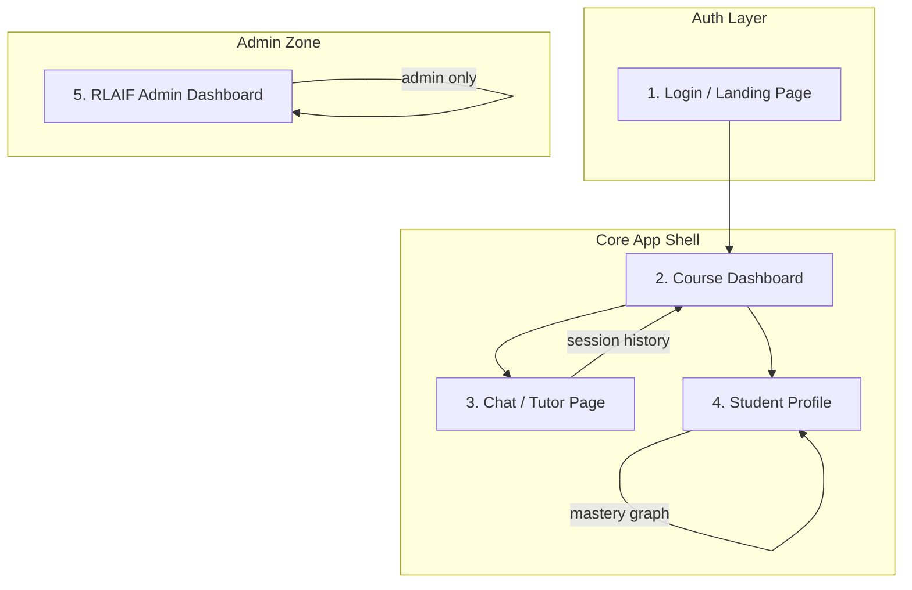

# EduVerse — Frontend Pages & Components Blueprint

> Derived from a complete audit of the backend at [backend/app/api/routes/](file:///home/vingw009/codefiles/proj/EduVerse/backend/app/api/routes)

---

## Architecture Overview



---

## Page-by-Page Breakdown

---

### 1. 🔐 Login / Landing Page

**Route:** `/` or `/login`

| Backend Endpoint | Method | Purpose |
|---|---|---|
| `/api/v1/auth/login/guest` | `POST` | Generate guest JWT |
| `/api/v1/auth/login/google` | `GET` | Redirect to Google OAuth |
| `/api/v1/auth/callback/google` | `GET` | OAuth callback (handled server-side, frontend receives JWT) |
| `/api/v1/auth/status` | `GET` | Check current auth + Google Classroom sync status |

**What to build:**
- Hero section with app branding
- **"Continue as Guest"** button → `POST /auth/login/guest` → stores `app_jwt` in localStorage/cookie
- **"Sign in with Google"** button → redirects to `GET /auth/login/google`
- OAuth callback handler page (`/auth/callback`) that extracts the `app_jwt` from the response and stores it
- Auth context provider that wraps the entire app, attaching the JWT as a `Bearer` token on every request

**Key response models:**
```typescript
// Guest login
interface GuestLoginResponse {
  user_id: string;
  app_jwt: string;
  is_guest: boolean;
}

// After Google OAuth callback — frontend reads this from the redirected JSON
interface OAuthResult {
  status: string;
  user_id: string;
  app_jwt: string;
}
```

---

### 2. 📚 Course Dashboard

**Route:** `/dashboard` or `/courses`

| Backend Endpoint | Method | Purpose |
|---|---|---|
| `/api/v1/courses/` | `GET` | List all courses (Google Classroom + local) |
| `/api/v1/courses/` | `POST` | Create a new local course/workspace |
| `/api/v1/courses/{course_id}` | `DELETE` | Delete a local course + its RAG index |
| `/api/v1/courses/{course_id}/files/{file_id}` | `DELETE` | Remove a specific file from a course |
| `/api/v1/courses/{course_id}/coursework` | `GET` | Fetch Google Classroom assignments |
| `/api/v1/ingestion/` | `POST` | Trigger ingestion pipeline for a course |
| `/api/v1/ingestion/sync` | `POST` | Force full re-sync of a course |
| `/api/v1/ingestion/status/{course_id}` | `GET` | Poll ingestion job progress |
| `/api/v1/ingestion/{course_id}/files` | `GET` | List all ingested/indexed files |
| `/api/v1/ingestion/upload` | `POST` | Upload a local PDF/DOCX/TXT/MD file |
| `/api/v1/ingestion/{course_id}` | `DELETE` | Wipe entire RAG index for a course |
| `/api/v1/ingestion/{course_id}/files/{filename}` | `DELETE` | Remove specific file from index |
| `/api/v1/sessions/?course_id=X` | `GET` | List chat sessions for a course |
| `/api/v1/auth/disconnect` | `DELETE` | Disconnect Google Classroom |
| `/api/v1/auth/wipe` | `POST` | Deep-clean all user data |

**What to build:**

#### Course Grid / List
- Card for each course showing `name`, `source` (classroom vs local), `is_ingested` badge, `assignment_count`
- Source badge differentiating **Google Classroom** courses vs **Local** courses
- **"+ New Workspace"** button → modal with name + description fields → `POST /courses/`
- Delete course button (with confirmation) → `DELETE /courses/{id}`

#### Per-Course Expanded View / Drawer
- **Files tab**: List from `GET /ingestion/{course_id}/files` — each showing `filename`, `chunk_count`, `source`
- **Upload button**: file picker (`.pdf, .txt, .md, .docx` only, max 100MB) → `POST /ingestion/upload` with `multipart/form-data`
- **Sync / Ingest button**: `POST /ingestion/` or `POST /ingestion/sync`
- **Ingestion progress bar**: Poll `GET /ingestion/status/{course_id}` every 2-3 seconds while status is `pending`/`processing`
- **Assignments tab** (for Classroom courses): `GET /courses/{course_id}/coursework`
- Delete individual file → `DELETE /ingestion/{course_id}/files/{filename}`

#### Settings Section
- **Disconnect Google** button → `DELETE /auth/disconnect`
- **Wipe All Data** button (danger zone) → `POST /auth/wipe`

**Key response models:**
```typescript
interface UnifiedCourse {
  id: string;
  name: string;
  source: "classroom" | "local";
  description?: string;
  is_ingested: boolean;
  assignment_count: number;
  created_at?: string;
  updated_at?: string;
}

interface IngestedFile {
  filename: string;
  chunk_count: number;
  source: string;
}

interface IngestionStatus {
  status: "none" | "pending" | "processing" | "completed" | "failed";
  error?: string;
  current_file_count: number;
}
```

---

### 3. 💬 Chat / AI Tutor Page (⭐ Core Feature)

**Route:** `/chat/{course_id}` or `/chat/{course_id}/{session_id}`

| Backend Endpoint | Method | Purpose |
|---|---|---|
| `/api/v1/chat/stream` | `POST` | Start a new AI tutoring conversation (SSE stream) |
| `/api/v1/chat/stream/resume` | `POST` | Resume a paused HITL conversation (SSE stream) |
| `/api/v1/chat/{session_id}/messages/{message_id}/feedback` | `POST` | Submit 👍/👎 feedback on a message |
| `/api/v1/sessions/?course_id=X` | `GET` | List previous sessions (sidebar) |
| `/api/v1/sessions/{session_id}` | `GET` | Load full message history |
| `/api/v1/sessions/{session_id}` | `DELETE` | Delete a session |
| `/api/v1/sessions/{session_id}` | `PATCH` | Rename a session |
| `/api/v1/proxy/pdf?url=X` | `GET` | Proxy PDF for citation deep-links |
| `/api/v1/cache/{course_id}` | `DELETE` | Clear semantic cache for course |

**What to build:**

#### Session Sidebar (Left Panel)
- List of sessions from `GET /sessions/?course_id=X` — showing `title`, `created_at`
- Click to load history via `GET /sessions/{session_id}`
- Right-click context menu: Rename (`PATCH`) / Delete (`DELETE`)
- **"+ New Chat"** button

#### Chat Interface (Center Panel)
- Message input with **text + optional image upload** (multimodal support)
  - `image_data`: base64 encoded image
  - `image_mimetype`: e.g. `image/png`
- **SSE Connection** to `POST /chat/stream` — must handle **7 event types**:

```typescript
// SSE Event Types to handle:
type SSEEvent =
  | { event: "status";          data: { message: string; session_id: string } }
  | { event: "node_start";      data: { node: string; message: string } }
  | { event: "node_end";        data: { node: string } }
  | { event: "tool_start";      data: { tool: string; input: any } }
  | { event: "tool_end";        data: { tool: string } }
  | { event: "retrieval_label"; data: { label: string; top_score: number; confidence_label: string; retrieval_ms: number } }
  | { event: "agent_thought";   data: { node: string; reasoning: string; [key: string]: any } }
  | { event: "token";           data: { text: string } }  // Streamed response tokens
  | { event: "done";            data: DonePayload }
  | { event: "error";           data: { message: string; code: string } }
```

```typescript
interface DonePayload {
  response: string;           // Final markdown response
  citations: Citation[];      // Grounded source references
  retrieval_label: string;    // "CLASSROOM_GROUNDED" | "CLASSROOM_LOW_CONFIDENCE" | "CLASSROOM_INSUFFICIENT"
  explainability: object;     // Debug retrieval metadata
  critic: object;             // Quality gate review
  agent_thoughts: AgentThought[];
  mermaid_graph: string;      // Mermaid diagram of the agent execution graph
  retrieval_ms: number;
  session_id: string;
  trace_url: string;          // LangSmith trace link
}

interface Citation {
  source_index: number;       // [Doc 1], [Doc 2], etc.
  title: string;
  alternate_link: string;     // Link to Google Classroom material
  file_url?: string;          // Direct PDF link for deep-linking
  content_type: string;
  page_number?: number;       // For PDF jump-to-page
  snippet: string;
}
```

#### HITL (Human-in-the-Loop) Interrupt UI
When the backend pauses due to insufficient classroom materials (`retrieval_label === "CLASSROOM_INSUFFICIENT"`), show a **decision modal**:
- **"Search the Web"** button → `POST /chat/stream/resume` with `decision: "search_web"`
- **"Stay with Course Materials"** button → `POST /chat/stream/resume` with `decision: "socratic_only"`

#### Message Rendering
- Markdown renderer for `response_text`
- **Citation cards** with clickable links — if `file_url` exists, open PDF via `/proxy/pdf?url=X` with `#page=N` for page-precise deep-linking
- **Feedback buttons** (👍 / 👎 + optional comment) per message → `POST /chat/{session_id}/messages/{message_id}/feedback`

#### Observability Drawer (Right Panel / Expandable)
- **Agent Thoughts** timeline — show each node's reasoning trace
- **Retrieval confidence badge** — color-coded by `retrieval_label`
- **Retrieval latency** display (`retrieval_ms`)
- **Mermaid execution graph** — render the `mermaid_graph` string
- **LangSmith trace link** — clickable `trace_url`
- **Critic review** summary

#### Chat Request Model
```typescript
interface ChatRequest {
  message: string;        // 1-4000 chars
  course_id: string;
  session_id?: string;    // Provide to continue existing conversation
  image_data?: string;    // Base64 encoded image
  image_mimetype?: string; // Default: "image/png"
}

interface HITLResumeRequest {
  session_id: string;
  decision: "search_web" | "socratic_only";
}
```

---

### 4. 👤 Student Profile Page

**Route:** `/profile`

| Backend Endpoint | Method | Purpose |
|---|---|---|
| `/api/v1/profile/` | `GET` | Fetch enriched profile with real-time stats |
| `/api/v1/profile/mastery/universe` | `GET` | D3-compatible knowledge graph data |

**What to build:**

#### Profile Overview Card
- `user_id`, `email`, `full_name`
- **Total Documents** indexed (`total_documents`)
- **Total Chat Sessions** (`actual_session_count`)
- **Topic Mastery** — horizontal bar chart or radar chart of `topic_mastery: { topic: score }`

#### Knowledge Universe Visualization (⭐ Showcase Feature)
- **Interactive D3 force-directed graph** using data from `GET /profile/mastery/universe`
- Nodes = topics, sized by `val`, colored by mastery score:
  - 🟢 Green (`> 0.7`) = Strong
  - 🟡 Yellow (`0.3-0.7`) = Developing
  - 🔴 Red (`< 0.3`) = Weak
- Links = prerequisite relationships between topics
- Hover on node to see topic name + exact score

```typescript
interface MasteryNode {
  id: string;
  name: string;
  val: number;    // Size: 10 + (score * 20)
  score: number;  // 0.0 - 1.0
  color: string;  // "#4ade80" | "#fbbf24" | "#f87171"
}

interface MasteryLink {
  source: string;
  target: string;
}

interface KnowledgeUniverseResponse {
  nodes: MasteryNode[];
  links: MasteryLink[];
}
```

---

### 5. 🧪 RLAIF Admin Dashboard (Admin Only)

**Route:** `/admin/rl` — gated by `role === "admin"` in JWT

| Backend Endpoint | Method | Purpose |
|---|---|---|
| `/api/v1/rl/stats` | `GET` | Global RL performance metrics |
| `/api/v1/rl/dashboard` | `GET` | Aggregated RLAIF analytics |
| `/api/v1/rl/models` | `GET` | List all registered fine-tuned models |
| `/api/v1/rl/episodes` | `GET` | List recent RL trajectories (admin only) |
| `/api/v1/rl/dpo/export` | `GET` | Download DPO preference pairs as JSONL |
| `/api/v1/rl/train/trigger` | `POST` | Trigger autonomous Kaggle training |
| `/api/v1/rl/train/distill` | `POST` | Trigger Shadow Auditor distillation |
| `/api/v1/rl/train/status` | `GET` | Check live training pipeline status |

**What to build:**

#### Performance Overview
- Stats cards from `GET /rl/stats`: total episodes, average reward, environment version
- Dashboard metrics from `GET /rl/dashboard`: aggregated across tutor/quiz/feedback agents

#### Model Registry Table
- From `GET /rl/models`: model name, version, role (tutor/quiz/feedback), status, created date

#### Model History Charts
- Per-role (tutor, quiz, feedback) performance history from `dashboard.model_history`

#### RL Trajectories Table
- Paginated list from `GET /rl/episodes` showing Query → Response → Reward triplets

#### Training Controls
- **"Trigger Training"** button → `POST /rl/train/trigger`
- **"Run Shadow Distillation"** button → `POST /rl/train/distill`
- **Training Status** badge: poll `GET /rl/train/status` — shows `running`/`complete`/`error`
- **"Export DPO Pairs"** download button → `GET /rl/dpo/export` (downloads `.jsonl` file)

---

## Additional Views / Shared Components

### 6. 🔒 Auth Callback Page
**Route:** `/auth/callback`
- Handles the redirect from Google OAuth
- Extracts `app_jwt` from the response
- Stores in localStorage/cookie
- Redirects to `/dashboard`

### 7. 📄 PDF Viewer Component
- Used inline in the chat page for citation deep-links
- Loads PDF via `/api/v1/proxy/pdf?url=X`
- Supports `#page=N` for jumping to specific pages
- Can be an embedded `<iframe>` or a library like `react-pdf`

### 8. ⚙️ Settings Page (or Section)
**Route:** `/settings`

| Backend Endpoint | Method | Purpose |
|---|---|---|
| `/api/v1/auth/status` | `GET` | Check Google Classroom connection |
| `/api/v1/auth/disconnect` | `DELETE` | Disconnect Google account |
| `/api/v1/auth/wipe` | `POST` | Deep wipe all user data |

- Google Classroom connection status + disconnect button
- Danger zone: wipe all data

---

## Summary: Complete Page Map

| # | Page | Route | Role | Key APIs |
|---|---|---|---|---|
| 1 | **Login / Landing** | `/login` | Public | `auth/login/guest`, `auth/login/google` |
| 2 | **OAuth Callback** | `/auth/callback` | Public | `auth/callback/google` |
| 3 | **Course Dashboard** | `/dashboard` | Auth'd | `courses/*`, `ingestion/*`, `sessions/` |
| 4 | **Chat / AI Tutor** | `/chat/:courseId` | Auth'd | `chat/stream`, `chat/stream/resume`, `sessions/*`, `proxy/pdf` |
| 5 | **Student Profile** | `/profile` | Auth'd | `profile/`, `profile/mastery/universe` |
| 6 | **Settings** | `/settings` | Auth'd | `auth/status`, `auth/disconnect`, `auth/wipe` |
| 7 | **RLAIF Dashboard** | `/admin/rl` | Admin | `rl/*` |
| 8 | **PDF Viewer** | (component) | Auth'd | `proxy/pdf` |

---

## SSE Integration Checklist

The chat page is the most complex component. Here's a checklist for the SSE implementation:

- [ ] Use `EventSource` or `fetch` with streaming body for `POST` SSE (EventSource only supports GET, so you'll need a fetch-based SSE parser)
- [ ] Handle all 10 event types: `status`, `node_start`, `node_end`, `tool_start`, `tool_end`, `retrieval_label`, `agent_thought`, `token`, `done`, `error`
- [ ] Accumulate `token` events into the response text for real-time streaming
- [ ] Parse the `done` payload to extract final `citations`, `mermaid_graph`, `agent_thoughts`
- [ ] Implement HITL interrupt detection and decision UI
- [ ] Handle `error` events gracefully with retry/fallback

---

## Tech Stack Recommendation

> [!TIP]
> Given the complexity (SSE streaming, D3 graphs, PDF viewing, admin dashboard), I'd recommend **Next.js 14+ (App Router)** with:
> - **next-auth** or custom JWT context for auth
> - **D3.js** or **react-force-graph** for the Knowledge Universe
> - **react-markdown** + **rehype-raw** for chat message rendering
> - **@microsoft/fetch-event-source** for POST-based SSE streaming
> - A charting library like **Recharts** or **Chart.js** for the RL dashboard
