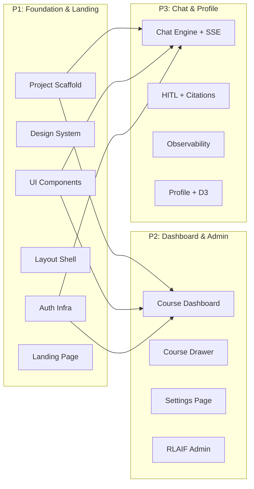

# EduVerse Frontend — 3-Person Team Implementation Plan

## Team Division Overview



> [!IMPORTANT]
> **P1 delivers the scaffold + shared components first (Day 1).** P2 and P3 begin building on Day 1 evening / Day 2 once the layout shell and auth context are merged.

---

## 👤 Person 1 — Foundation & Infra Lead

**Scope**: Project scaffold, design system, shared UI kit, layout shell, auth flow, landing page, API client + SSE helper.

**This person's output is the "platform" that P2 and P3 build on.**

### Files to Create

| File | Purpose |
|------|---------|
| `frontend/` (scaffold) | Next.js 15 + Tailwind v4 + TypeScript |
| `src/app/globals.css` | Tailwind `@theme` with all design tokens |
| `src/app/layout.tsx` | Root layout, Inter font, dark body, AuthProvider |
| `src/app/page.tsx` | Cinematic landing page with GSAP |
| `src/app/auth/callback/page.tsx` | OAuth JWT extraction + redirect |
| `src/app/(app)/layout.tsx` | Authenticated shell (sidebar + main) |
| `src/components/layout/Sidebar.tsx` | Twitter-style left nav |
| `src/components/layout/AppShell.tsx` | 3-column wrapper |
| `src/components/ui/Button.tsx` | Variants: primary, ghost, danger, icon |
| `src/components/ui/Modal.tsx` | Animated modal + backdrop |
| `src/components/ui/Badge.tsx` | Pill-shaped status badges |
| `src/components/ui/Drawer.tsx` | Slide-in right panel |
| `src/components/ui/Loader.tsx` | Skeleton pulser, progress bar, typing indicator |
| `src/lib/auth-context.tsx` | JWT context: login, loginAsGuest, logout, user state |
| `src/lib/api.ts` | Typed fetch wrappers (GET/POST/DELETE/PATCH) + Bearer token |
| `src/lib/sse.ts` | POST-based SSE parser with typed event callbacks |
| `src/lib/types.ts` | Shared TypeScript interfaces for all API models |

### Task List

```
- [ ] Run `npx create-next-app@latest ./` in `frontend/`
- [ ] Install deps: gsap, @microsoft/fetch-event-source, lucide-react, react-markdown, rehype-raw, remark-gfm, d3, @types/d3
- [ ] Define `@theme` in globals.css (all colors, fonts, animations)
- [ ] Create `src/lib/types.ts` — all shared interfaces (UnifiedCourse, ChatRequest, Citation, SSEEvent, ProfileResponse, etc.)
- [ ] Create `src/lib/api.ts` — base fetch client with JWT injection
- [ ] Create `src/lib/sse.ts` — SSE stream helper for POST endpoints
- [ ] Create `src/lib/auth-context.tsx` — AuthProvider + useAuth hook
- [ ] Build UI kit: Button, Modal, Badge, Drawer, Loader
- [ ] Build Sidebar.tsx (nav links: Dashboard, Profile; admin section conditional)
- [ ] Build AppShell.tsx (sidebar | main | optional right panel)
- [ ] Create root layout.tsx (Inter font, dark bg, AuthProvider wrap)
- [ ] Create `(app)/layout.tsx` (wraps authenticated pages with AppShell)
- [ ] Build landing page with GSAP staggered fade-up + gradient orb
- [ ] Build auth callback page (extract JWT → localStorage → redirect)
- [ ] Update .gitignore for node_modules, .next, .env.local
- [ ] Verify: `npm run build` passes, `npm run dev` serves landing page
```

---

## 👤 Person 2 — Dashboard, Settings & Admin

**Scope**: Course dashboard (bento grid), course management (drawer, upload, ingestion), settings page, RLAIF admin dashboard.

**Depends on**: P1's layout shell, UI components, API client, types.

### Files to Create

| File | Purpose |
|------|---------|
| `src/app/(app)/dashboard/page.tsx` | Course grid + "New Workspace" button |
| `src/components/courses/CourseCard.tsx` | Flat card with hover, badges, status dot |
| `src/components/courses/CourseDrawer.tsx` | Files tab + Assignments tab, upload, sync |
| `src/components/courses/CreateCourseModal.tsx` | Name + description form |
| `src/components/courses/FileList.tsx` | Ingested files table with delete actions |
| `src/components/courses/IngestionBar.tsx` | Thin progress bar (polls status endpoint) |
| `src/app/(app)/settings/page.tsx` | Google connection + disconnect + data wipe |
| `src/app/(app)/admin/rl/page.tsx` | RLAIF dashboard: stats, models, episodes, training |
| `src/components/admin/StatsCard.tsx` | Large number + label metric card |
| `src/components/admin/ModelTable.tsx` | Registry table with monospace IDs |
| `src/components/admin/TrainingControls.tsx` | Trigger/distill buttons + status badge |

### Task List

```
- [ ] Build CourseCard.tsx — flat #000 bg, 1px #2F3336 border, hover rgba(239,243,244,0.03)
- [ ] Build badges: source pill (Classroom/Local), ingestion dot (green/yellow/red)
- [ ] Build CreateCourseModal.tsx — name + description → POST /api/v1/courses/
- [ ] Build dashboard/page.tsx — fetch courses, render grid, "+ New Workspace" button
- [ ] Build FileList.tsx — GET /ingestion/{courseId}/files, delete actions
- [ ] Build IngestionBar.tsx — poll GET /ingestion/status/{courseId} every 3s
- [ ] Build CourseDrawer.tsx — tabs (Files/Assignments), file upload (multipart), sync button
- [ ] Wire upload: file picker (.pdf,.txt,.md,.docx, max 100MB) → POST /ingestion/upload
- [ ] Wire coursework: GET /courses/{courseId}/coursework for Classroom courses
- [ ] Build settings/page.tsx — auth status, disconnect (DELETE), wipe (POST, danger zone)
- [ ] Build StatsCard.tsx — large number, tiny label
- [ ] Build ModelTable.tsx — model name, version, role, status (monospace fonts for IDs)
- [ ] Build TrainingControls.tsx — trigger/distill buttons + poll training status
- [ ] Build admin/rl/page.tsx — stats overview, model registry, episode list, DPO export link
- [ ] Verify: all pages render, API calls work against backend at localhost:8000
```

### API Endpoints Used

| Endpoint | Method | Component |
|----------|--------|-----------|
| `/api/v1/courses/` | GET, POST | Dashboard |
| `/api/v1/courses/{id}` | DELETE | CourseCard |
| `/api/v1/courses/{id}/coursework` | GET | CourseDrawer |
| `/api/v1/courses/{id}/files/{fid}` | DELETE | FileList |
| `/api/v1/ingestion/` | POST | CourseDrawer |
| `/api/v1/ingestion/sync` | POST | CourseDrawer |
| `/api/v1/ingestion/status/{id}` | GET | IngestionBar |
| `/api/v1/ingestion/{id}/files` | GET | FileList |
| `/api/v1/ingestion/upload` | POST | CourseDrawer |
| `/api/v1/ingestion/{id}` | DELETE | CourseDrawer |
| `/api/v1/auth/status` | GET | Settings |
| `/api/v1/auth/disconnect` | DELETE | Settings |
| `/api/v1/auth/wipe` | POST | Settings |
| `/api/v1/rl/stats` | GET | Admin |
| `/api/v1/rl/dashboard` | GET | Admin |
| `/api/v1/rl/models` | GET | Admin |
| `/api/v1/rl/episodes` | GET | Admin |
| `/api/v1/rl/dpo/export` | GET | Admin |
| `/api/v1/rl/train/trigger` | POST | Admin |
| `/api/v1/rl/train/distill` | POST | Admin |
| `/api/v1/rl/train/status` | GET | Admin |

---

## 👤 Person 3 — Chat Engine & Profile

**Scope**: The entire chat/AI tutor experience (SSE streaming, HITL, citations, observability) and the student profile with D3 Knowledge Universe.

**Depends on**: P1's layout shell, UI components, API client, SSE helper, types.

### Files to Create

| File | Purpose |
|------|---------|
| `src/app/(app)/chat/[courseId]/page.tsx` | 3-panel chat layout (sessions | chat | debug) |
| `src/components/chat/SessionSidebar.tsx` | Session list, rename, delete, "+ New Chat" |
| `src/components/chat/ChatStream.tsx` | Message list with markdown, streaming cursor |
| `src/components/chat/ChatInput.tsx` | Text + image upload input bar |
| `src/components/chat/MessageBubble.tsx` | User (right, panel bg) vs AI (left, transparent) |
| `src/components/chat/HITLInterrupt.tsx` | Warning-bordered decision block |
| `src/components/chat/CitationPill.tsx` | Inline `[1]` pills with hover tooltip |
| `src/components/chat/ObservabilityDrawer.tsx` | Agent thoughts, Mermaid graph, retrieval badge |
| `src/components/chat/StreamingCursor.tsx` | Pulsing `█` cursor during token streaming |
| `src/hooks/useChatStream.ts` | Custom hook: manages SSE connection + chat state |
| `src/app/(app)/profile/page.tsx` | Stats cards + Knowledge Universe container |
| `src/components/profile/KnowledgeUniverse.tsx` | D3 force-directed graph |
| `src/components/profile/StatStrip.tsx` | Large stats row |

### Task List

```
- [ ] Build useChatStream.ts — useReducer-based state machine for SSE events
      States: idle → connecting → streaming → hitl_paused → done → error
      Actions: dispatch for each of the 10 SSE event types
- [ ] Build MessageBubble.tsx — user (right, #16181C bg) vs AI (left, transparent)
- [ ] Build StreamingCursor.tsx — pulsing gray █ rectangle
- [ ] Build CitationPill.tsx — inline [N] pill, hover shows snippet tooltip
- [ ] Build ChatStream.tsx — renders message list, auto-scrolls, markdown via react-markdown
- [ ] Build ChatInput.tsx — text area + image attach button + send
- [ ] Build HITLInterrupt.tsx — #FFD400 bordered block with two buttons
- [ ] Build SessionSidebar.tsx — list sessions, right-click rename/delete, "+ New Chat"
- [ ] Build ObservabilityDrawer.tsx — agent thoughts timeline, retrieval confidence badge,
      Mermaid graph render, LangSmith link, critic review
- [ ] Build chat/[courseId]/page.tsx — 3-panel layout, wire useChatStream hook
- [ ] Wire SSE: POST /chat/stream for new messages
- [ ] Wire SSE: POST /chat/stream/resume for HITL decisions
- [ ] Wire feedback: POST /chat/{sid}/messages/{mid}/feedback (thumbs up/down)
- [ ] Wire sessions: GET/DELETE/PATCH /sessions/
- [ ] Wire PDF proxy: open /proxy/pdf?url=X in split pane or new tab
- [ ] Build StatStrip.tsx — large numbers + tiny labels row
- [ ] Build KnowledgeUniverse.tsx — D3 force-directed graph, glowing nodes, dark canvas
      Nodes: sized by `val`, colored by score (green/yellow/red)
      Links: rgba(255,255,255,0.1) lines
      Interaction: hover shows topic name + score tooltip
- [ ] Build profile/page.tsx — GET /profile/, GET /profile/mastery/universe
- [ ] Verify: full chat flow works end-to-end with streaming tokens
- [ ] Verify: D3 graph renders with mock data
```

### API Endpoints Used

| Endpoint | Method | Component |
|----------|--------|-----------|
| `/api/v1/chat/stream` | POST (SSE) | useChatStream |
| `/api/v1/chat/stream/resume` | POST (SSE) | HITLInterrupt |
| `/api/v1/chat/{sid}/messages/{mid}/feedback` | POST | MessageBubble |
| `/api/v1/sessions/?course_id=X` | GET | SessionSidebar |
| `/api/v1/sessions/{sid}` | GET, DELETE, PATCH | SessionSidebar |
| `/api/v1/proxy/pdf?url=X` | GET | CitationPill |
| `/api/v1/cache/{courseId}` | DELETE | ObservabilityDrawer |
| `/api/v1/profile/` | GET | Profile page |
| `/api/v1/profile/mastery/universe` | GET | KnowledgeUniverse |

---

## Timeline

| Day | P1 (Foundation) | P2 (Dashboard & Admin) | P3 (Chat & Profile) |
|-----|-----------------|------------------------|----------------------|
| **1** | Scaffold + design system + UI kit + auth + API client | Study API schemas, prep mock data | Study SSE event types, design state machine |
| **1 EOD** | **Merge: layout shell + landing page** | — | — |
| **2** | Landing page polish + GSAP | CourseCard + Dashboard page | useChatStream hook + MessageBubble |
| **3** | Auth callback + SSE helper | CourseDrawer + upload + ingestion | ChatStream + ChatInput + streaming |
| **4** | Code review + bug fixes | Settings page | HITL + Citations + ObservabilityDrawer |
| **5** | Integration testing | RLAIF Admin Dashboard | Profile page + D3 Knowledge Universe |
| **6** | **Full integration + polish + responsive testing** |||

---

## Shared Contracts (P1 Delivers for Everyone)

> [!IMPORTANT]
> P1 must deliver these interfaces in `src/lib/types.ts` on **Day 1** so P2 and P3 can type their components:

```typescript
// Key interfaces P2 and P3 depend on:
UnifiedCourse, IngestedFile, IngestionStatus     // P2
ChatRequest, HITLResumeRequest, Citation          // P3
SSEEventMap, DonePayload, AgentThought            // P3
ProfileResponse, KnowledgeUniverseResponse        // P3
MasteryNode, MasteryLink                          // P3
GuestLoginResponse                                // P1
```

> [!TIP]
> Each person should create a `__mock__/` folder with sample JSON responses for their API endpoints so they can develop without needing the backend running.
